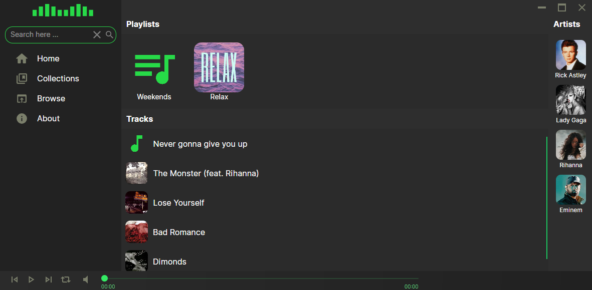
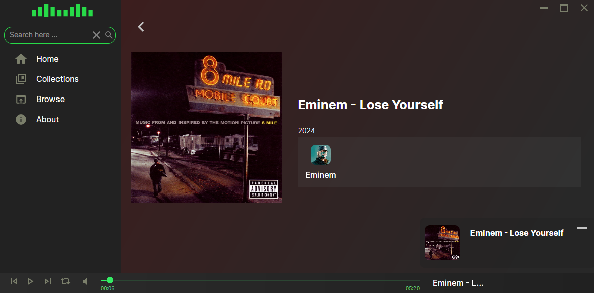

## About
**Ild-Music** - comffy music player to have a fun and et relaxed. Take install, enjoy music. 

## History
In 2021 project has been started for educational purposes (learn programming). However I faced with 2 problems, that I had a lot of music file (primary mp3) and there was not any of tool to playback and enjoy on Windows and Linux with the same experience. In next year (2022) i decided to take upgrade and result was 0.6 version (see in release notes). But it still looked weired, so by this reason in May of 2024 I started redesign whole project for better experience.

## Install and run
Start using Ild-Music player:
  1)  Visit [Releases page](https://github.com/ggghosthat/Ild-Music/releases) and download the last version for your operating system.
     1.1) If you use linux operating system, make sure you have installed `libvlc-dev` package.
  2)  Extract files to directory
  3)  Launch `Ild-Music` executable file

## Contribute
Ild-Music is open-source driven project and I am very welcome contributions from everyone. Whether you are developer or enthusiast.
For more details follow [this document]().  

## Technologies
- [.NET/C#](https://github.com/dotnet) - developement platform with c# programming language
- [Avalonia UI](https://github.com/AvaloniaUI) - cross-platform UI framework for .NET
- [Dapper](https://github.com/DapperLib/Dapper) - simple object mapper for .Net
- [taglib-sharp](https://github.com/mono/taglib-sharp) - library for reading and writing metadata in media files
- [LibVLCSharp](https://github.com/videolan/libvlcsharp) - cross-platform audio and video API for .NET platforms based on VideoLAN's LibVLC Library
- [NAudio](https://github.com/naudio/NAudio) - audio library for .NET based on Windows API
- [ImageSharp](https://github.com/SixLabors/ImageSharp) - graphics library for image procession

## Contact me
- [**Email**](mailto:ildairldar990@gmail.com), [**Discord**](https://discord.gg/dXqkwyyR), [**Bluesky**](https://bsky.app/profile/ggghosthat.bsky.social)
